  

  
  
  

<table>
  <tr>
    <td></td>
    <td></td>
  </tr>
  <tr>
    <td></td>
    <td></td>
  </tr>
</table>

More in my <a href="https://github.com/ShreyanshFS?tab=repositories">repositories</a>, including DSA in Java and machine learning algorithms.

  
  

  The easiest way to reach me is <a href="mailto:2k25cse2513910@gmail.com">email</a> or <a href="https://linkedin.com/in/shreyanshfr">LinkedIn</a>. 
  Open to internships, collaborations, and project ideas.

