<p align="center">
  
</p>

<p align="center">
  <a href="https://linkedin.com/in/shreyanshfr"></a>
  <a href="mailto:2k25cse2513910@gmail.com"></a>
  <a href="https://github.com/ShreyanshFS?tab=repositories"></a>
</p>

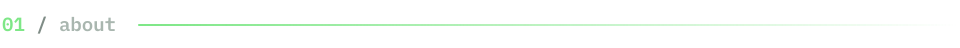

```yaml
whoami:
  name: Shreyansh Dwivedi
  role: Aspiring Software Engineer
  builds: practical projects, from AI vision apps to ML pipelines
  sharpening: core fundamentals, DSA in Java
  approach: build real things first, then refine the basics behind them
  open_to: [internships, collaborations, project ideas]
```

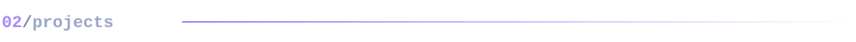

<table>
  <tr>
    <td><a href="https://github.com/ShreyanshFS/SmartGrid-Intelligent-Home-Power-System"></a></td>
    <td><a href="https://github.com/ShreyanshFS/ATTENDANCE_AI_Running"></a></td>
  </tr>
  <tr>
    <td><a href="https://github.com/ShreyanshFS/FasalRakshak-AI-Powered-Crop-Loss-Evidence-Verification-System">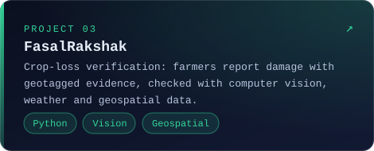</a></td>
    <td><a href="https://github.com/ShreyanshFS?tab=repositories">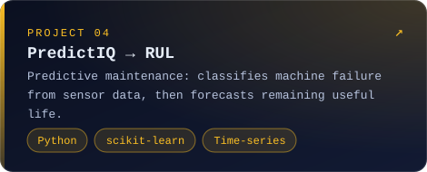</a></td>
  </tr>
</table>

<p align="center"><sub>More in <a href="https://github.com/ShreyanshFS?tab=repositories">repositories</a>, including DSA in Java and machine learning algorithms.</sub></p>

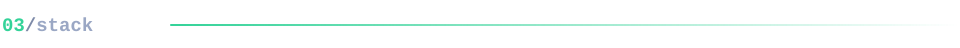

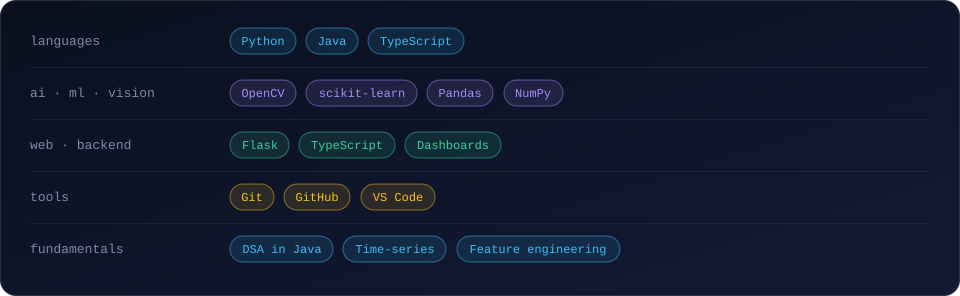

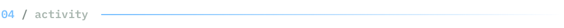

<p align="center">
  
  
</p>

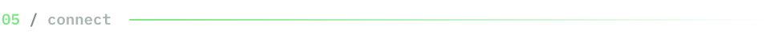

<p align="center">
  Currently building the RUL forecaster and strengthening DSA in Java.<br/>
  Open to internships and people to build with.<br/><br/>
  <a href="mailto:2k25cse2513910@gmail.com">2k25cse2513910@gmail.com</a> &nbsp;·&nbsp; <a href="https://linkedin.com/in/shreyanshfr">linkedin.com/in/shreyanshfr</a>
</p>


